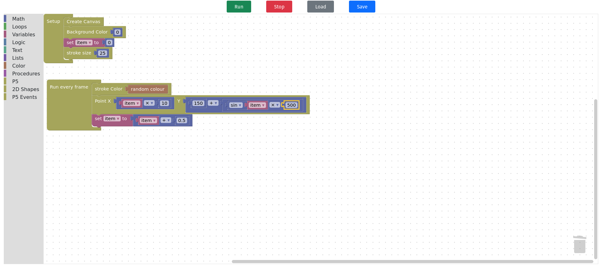
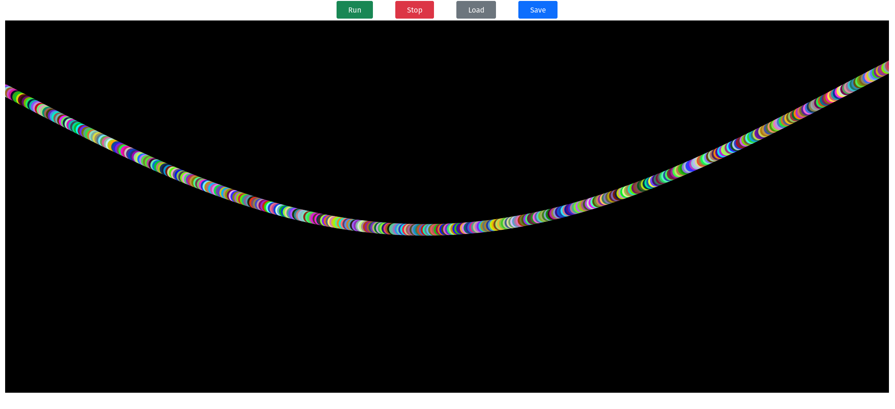

# p5.block

This is a blockly implementation of p5.js allowing you to create p5.js sketches without writing code. It currently only supports a subset of the full p5.js api.
Pull requests adding additional api functionality are welcome.

You can play with it [here](https://netanel-m.github.io/p5.block/).
